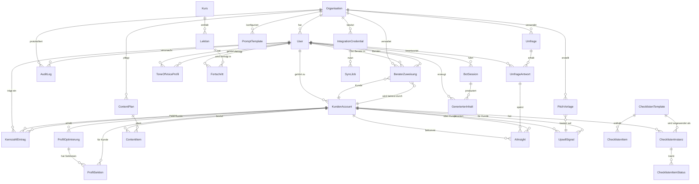

# PLAN.md — Zielarchitektur Content-Leads-Plattform

**Datum:** 2026-07-26

---

## 1 — Domänenmodell (ERD)



### Entitäten-Übersicht

| Entität | Tabelle | Beschreibung |
|---|---|---|
| Organisation | `organisations` (NEU, ersetzt `accounts`+`tenants`) | Zentrale Mandanten-Entität |
| User | `profiles` (erweitert) | Auth-User mit Rolle |
| KundenAccount | `customer_accounts` (NEU) | Kunden-Record innerhalb einer Organisation |
| BeraterZuweisung | `advisor_assignments` (NEU) | N:M Berater↔Kunde |
| Kurs | `courses` (NEU) | Akademie-Kurs |
| Lektion | `lessons` (NEU) | Video/Text/Quiz-Lektion |
| Fortschritt | `lesson_progress` (NEU) | Abschluss pro User pro Lektion |
| BotSession | `bot_sessions` (NEU) | KI-Chat-Verlauf |
| GenerierterInhalt | `generated_content` (NEU) | Gespeicherter KI-Output |
| ToneOfVoiceProfil | `tone_of_voice_profiles` (NEU) | Tonalität, Themen, No-Gos pro User |
| ProfilOptimierung | `profile_optimizations` (NEU) | LinkedIn-Profil-Überarbeitung |
| ProfilSektion | `profile_sections` (NEU) | Headline, About, Erfahrung etc. |
| ChecklistenTemplate | `checklist_templates` (NEU) | Wiederverwendbare Checkliste |
| ChecklistenItem | `checklist_template_items` (NEU) | Item in einem Template |
| ChecklistenInstanz | `checklist_instances` (NEU) | Angewandte Checkliste auf Kunde |
| ChecklistenItemStatus | `checklist_item_statuses` (NEU) | Abhak-Status + interne Notizen |
| ContentItem | `content_items` (NEU) | Einzelner Content-Piece |
| ContentPlan | `content_plans` (NEU) | Redaktionsplan pro Kunde |
| KennzahlEintrag | `metrics_snapshot` (existiert) | Manuelle + API-Kennzahlen |
| IntegrationCredential | `integration_credentials` (NEU, ersetzt `account_integrations`) | Verschlüsselte API-Keys |
| SyncJob | `sync_jobs` (NEU) | Scheduled Sync mit Status |
| Umfrage | `surveys` (NEU) | NPS + Custom-Fragen |
| UmfrageAntwort | `survey_responses` (NEU) | Einzelantwort |
| AIInsight | `ai_insights` (NEU) | KI-generierte Erkenntnisse mit Quell-Verlinkung |
| UpsellSignal | `upsell_signals` (NEU) | Erkanntes Upsell-Potenzial |
| PitchVorlage | `pitch_templates` (NEU) | Fertige Gesprächsaufhänger |
| AuditLog | `audit_log` (NEU) | Alle schreibenden Aktionen |
| PromptTemplate | `prompt_templates` (NEU) | Versionierte Prompt-Registry |

---

## 2 — Rollen-/Rechte-Matrix

| Ressource | Admin | Berater (eigene Kunden) | Berater (fremde Kunden) | Kunde |
|---|---|---|---|---|
| Organisation | CRUD | R | — | — |
| User (Profile) | CRUD | R eigene + zugewiesene | — | R/U eigenes |
| KundenAccount | CRUD | R/U zugewiesene | — | R eigenes |
| BeraterZuweisung | CRUD | R eigene | — | R (sieht Berater-Name) |
| Kurse/Lektionen | CRUD (CMS) | R | — | R freigeschaltete |
| Fortschritt | R alle | R zugewiesene Kunden | — | R/C eigener |
| BotSession | R alle | R zugewiesene Kunden | — | CRUD eigene |
| GenerierterInhalt | R alle | R/C zugewiesene | — | CRUD eigene |
| ToneOfVoiceProfil | R alle | R zugewiesene | — | CRUD eigenes |
| ProfilOptimierung | R alle | CRUD zugewiesene | — | R + Freigabe eigene |
| Checklisten-Template | CRUD | CRUD eigene | — | — |
| Checklisten-Instanz | R alle | CRUD zugewiesene | — | R ohne interne Notizen |
| ContentItem | R alle | CRUD zugewiesene | — | R/U eigene (Freigabe) |
| ContentPlan | R alle | CRUD zugewiesene | — | R eigener |
| KennzahlEintrag | CRUD | R zugewiesene | — | C/R eigene |
| IntegrationCredential | CRUD | — | — | CRUD eigene (maskiert) |
| SyncJob | CRUD | — | — | R eigene |
| Umfrage | CRUD | R | — | R zugestellte |
| UmfrageAntwort | R alle | R zugewiesene | — | C eigene |
| AIInsight | CRUD | R zugewiesene | — | R eigene |
| UpsellSignal | CRUD | R zugewiesene | — | — |
| PitchVorlage | CRUD | R zugewiesene | — | — |
| AuditLog | R | — | — | — |
| PromptTemplate | CRUD | — | — | — |
| Feature-Flags | CRUD | — | — | — |

**Kernregel:** Berater sieht NUR zugewiesene Kunden (via `advisor_assignments`). Jede Query muss diesen Scope erzwingen — serverseitig via RLS + Edge Function Checks.

---

## 3 — Modulgrenzen / Ordnerstruktur

```
src/
├── design-system/           # Gold Design-System (bereits implementiert)
│   ├── tokens/
│   ├── components/
│   └── assets/
├── components/
│   ├── ui/                  # shadcn/ui (bestehend)
│   ├── layout/              # DashboardLayout, Sidebar, TopBar
│   ├── admin/               # Admin-spezifische Komponenten
│   ├── advisor/             # Berater-spezifische Komponenten (NEU)
│   ├── customer/            # Kunden-spezifische Komponenten
│   ├── academy/             # Akademie-Komponenten (NEU)
│   ├── ai/                  # KI-Bot-Komponenten (NEU)
│   ├── checklist/           # Checklisten-Komponenten (NEU)
│   ├── content/             # Content-Pipeline-Komponenten (NEU)
│   ├── metrics/             # Kennzahlen-Komponenten (NEU)
│   ├── survey/              # Umfrage-Komponenten (NEU)
│   └── shared/              # Feature-Gate, ErrorBoundary, etc.
├── services/                # NEU: Zentraler Service-Layer
│   ├── supabase.ts          # Singleton Client
│   ├── ai.ts                # Zentraler AI-Service (Prompt-Registry, Cost-Tracking)
│   ├── auth.ts              # Auth-Service
│   ├── audit.ts             # Audit-Log-Service
│   └── integrations.ts      # Integration-Service (Encryption, Sync)
├── hooks/                   # React Hooks
├── contexts/                # React Context Provider
├── pages/                   # Route-Pages
├── lib/                     # Utilities
└── types/                   # TypeScript Types (aus Supabase generiert)

supabase/
├── migrations/              # NEU: Alle Schema-Migrationen
├── functions/               # Edge Functions (bestehend + neue)
│   ├── _shared/
│   │   ├── cors.ts
│   │   ├── auth.ts          # NEU: Shared Auth-Helper (Role-Check, Tenant-Scope)
│   │   ├── ai.ts            # NEU: Shared AI-Helper (Prompt-Loading, Cost-Logging)
│   │   └── email-templates/
│   └── [functions]/
└── config.toml              # NEU: Supabase-Konfiguration
```

---

## 4 — KI-Layer

**Zentral:** Ein `AIService` in `src/services/ai.ts` + ein shared `_shared/ai.ts` für Edge Functions.

| Aspekt | Implementierung |
|---|---|
| Prompt-Registry | `prompt_templates` Tabelle: name, version, system_prompt, user_prompt_template, model, temperature, max_tokens. Admin-UI zur Verwaltung. |
| Modell-Aufrufe | Edge Functions nutzen `_shared/ai.ts` → lädt Prompt aus DB → sendet an Anthropic/OpenAI → loggt Kosten |
| Kosten-Logging | `ai_usage_log` Tabelle: org_id, user_id, prompt_template_id, model, input_tokens, output_tokens, cost_cents, created_at |
| Retry/Fallback | Primary: Anthropic Claude. Fallback: OpenAI GPT-4o. Exponential Backoff. |
| Strukturierte Outputs | Zod-Schema-Validierung in Edge Functions |
| ToV-Integration | Jeder Bot-Aufruf lädt automatisch `tone_of_voice_profiles` des Users als System-Kontext |

---

## 5 — Integrations-Layer

```
IntegrationCredential (DB)
    ↓ verschlüsselt at rest (envelope encryption via Supabase Vault)
    ↓
IntegrationService (Edge Function)
    ↓ entschlüsselt nur zur Laufzeit
    ↓
Provider-Adapter (HeyReach, SMTP, Twilio, ...)
    ↓
SyncJob (Scheduler)
    ↓ Cron-basiert, Backoff bei Rate Limits
    ↓
SyncHistory (Log pro Job)
```

| Aspekt | Implementierung |
|---|---|
| Verschlüsselung | Supabase Vault Extension für Secrets. Frontend sieht nur maskierte Werte (`****xyz`). |
| Verbindungstest | Edge Function `test-integration` — sendet Test-Request mit gespeicherten Credentials |
| Sync-Scheduler | Supabase pg_cron oder Vercel Cron Jobs → Edge Function |
| Fehler-Backoff | Exponential: 1m → 5m → 15m → 1h → manuell. Status in `sync_jobs`. |
| Quell-Markierung | `metrics_snapshot.source` Spalte: `manual` | `api_heyreach` | `api_sheet` |

---

## 5 wichtigsten Architekturentscheidungen

### 1. Konsolidierung auf ein Tenant-Modell (`organisations`)
**Entscheidung:** `accounts` + `tenants` zusammenführen zu einer `organisations` Tabelle.
**Alternative:** Beides beibehalten mit FK-Verknüpfung.
**Begründung:** Zwei parallele Tenant-Konzepte sind die Hauptursache für Komplexität und IDOR-Risiken. Ein Modell = eine RLS-Policy = eine Wahrheit.

### 2. RLS-First statt Frontend-Only-Filtering
**Entscheidung:** PostgreSQL Row-Level Security auf allen Tabellen. Jede Tabelle hat `org_id` + RLS-Policy.
**Alternative:** Service-Layer-Filterung in Edge Functions.
**Begründung:** Defense-in-depth. Selbst bei einem Bug im Frontend/Edge Function sind Daten geschützt.

### 3. Prompt-Registry in DB statt Inline
**Entscheidung:** Prompts in `prompt_templates` Tabelle, versioniert, Admin-editierbar.
**Alternative:** Prompts als Files im Repo (erfordert Deploy für Änderung).
**Begründung:** Business-User (Admin) muss Prompts tunen können ohne Developer-Deployment.

### 4. Vite SPA beibehalten statt Migration auf Next.js
**Entscheidung:** Bei Vite + React Router bleiben.
**Alternative:** Migration auf Next.js App Router für SSR/RSC.
**Begründung:** Die App ist eine interne Plattform mit Auth-Gate — kein SEO nötig. Migration wäre wochenlange Arbeit ohne Nutzen. Edge Functions auf Supabase sind das Backend.

### 5. Design-System als CSS-Variables + JSX-Komponenten
**Entscheidung:** Gold Design-System (apple-red → gold rebrand) als `src/design-system/` mit CSS Custom Properties.
**Alternative:** Alles in Tailwind-Config überführen.
**Begründung:** Die DS-Komponenten nutzen Inline-Styles mit CSS-Vars. Beides (DS + Tailwind/shadcn) koexistiert — DS für neue Seiten, shadcn für bestehende. Schrittweise Migration.

---

## Top-3 Risiken für die Umsetzung

1. **Schema-Migration ohne Backup:** Es gibt keine Migrationsdateien. Der erste Schritt ist `supabase db dump` der Prod-DB, dann schrittweise Migrationen. Ein Fehler hier kann Prod-Daten zerstören. → **Mitigation:** Dump vor jedem Schritt, reversible Migrationen, Feature-Branches.

2. **Tenant-Konsolidierung bricht bestehende Queries:** Umbenennung von `account_id`/`tenant_id` → `org_id` betrifft ~50% aller Edge Functions und Hooks. → **Mitigation:** Kompatibilitäts-Views als Übergangsschicht, schrittweise Migration.

3. **Umfang:** Die Spezifikation beschreibt ~6 Monate Arbeit. Ohne Priorisierung und MVP-Cuts besteht das Risiko, in M0 stecken zu bleiben. → **Mitigation:** M0 minimal halten (RLS + Audit + Tenant-Fix), dann M1-M4 als vertikale Slices pro Modul.

---

## Annahmen, die korrigiert werden sollten

1. **Supabase-Projekt wird beibehalten** — kein neues Supabase-Projekt. Falls gewünscht: vorher sagen.
2. **Prod-DB-Dump ist möglich** — ich gehe davon aus, dass du Zugang zum Supabase Dashboard hast für `supabase db dump`.
3. **Kein HeyReach-Account vorhanden** — ich plane die Integration als Interface, implementiere aber nur den Adapter wenn Credentials da sind.
4. **Felix ist einziger Admin** — RLS-Policies und Seed-Daten gehen von einem Admin-User aus.
5. **Outreach-Features bleiben gesperrt** — der Dead Code (~40 Seiten) wird nicht angefasst, nur aufgeräumt wenn er Build-Probleme verursacht.
6. **E-Mail-Versand über Resend** — kein eigener SMTP-Server nötig für System-Mails.
7. **Budget für AI-APIs (Anthropic, OpenAI) ist vorhanden** — Cost-Tracking wird gebaut, aber ich setze kein Hard-Limit.
