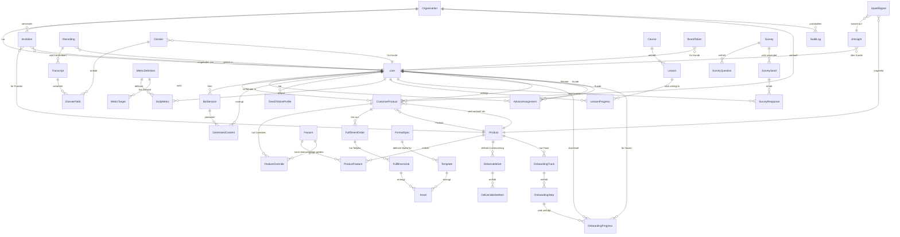

# PLAN.md v3 — Zielarchitektur Content-Leads-Plattform

**Datum:** 2026-07-27

---

## 1 — Domänenmodell (ERD)

---

## 2 — Neue Entitäten (26 Tabellen)

### Kern: Produkt- & Entitlement-Modell
| Tabelle | Spalten (Kern) | Beschreibung |
|---|---|---|
| `products` | id, slug, name, description, status (active/draft/archived), created_at | Produktdefinition |
| `features` | id, slug, name, description, category | Atomare Fähigkeit (z.B. bot.leadpost, profil.banner) |
| `product_features` | id, product_id FK, feature_id FK | N:M Zuordnung |
| `customer_products` | id, org_id, user_id FK, product_id FK, status (onboarding/active/paused/ended), tier, started_at, ended_at | Kundenbuchung |
| `feature_overrides` | id, customer_product_id FK, feature_id FK, is_enabled, reason, expires_at | Einzelfreischaltung |

### Onboarding
| Tabelle | Spalten (Kern) | Beschreibung |
|---|---|---|
| `onboarding_tracks` | id, product_id FK, name, steps_json, dedup_key | Track-Definition |
| `onboarding_steps` | id, track_id FK, type (form/video/booking/recording/upload/approval/confirm), title, config_json, order, unlocks_features[] | Schritt-Definition |
| `onboarding_progress` | id, user_id FK, step_id FK, status (pending/in_progress/completed/skipped), data_json, completed_at | Fortschritt |

### Recording & Dossier
| Tabelle | Spalten (Kern) | Beschreibung |
|---|---|---|
| `recordings` | id, user_id FK, org_id, consent_given_at, consent_text, duration_seconds, storage_url, status (recording/processing/done/deleted), deleted_at | Aufnahme mit Consent |
| `transcripts` | id, recording_id FK, full_text, speakers_json, model, created_at | Transkript mit Sprechertrennung |
| `dossiers` | id, user_id FK, org_id, version, completeness_score, approved_by FK, approved_at, status (draft/approved) | Strukturiertes Kundenwissen |
| `dossier_fields` | id, dossier_id FK, field_key, value_text, source (form/transcript/manual), source_ref, confidence, conflict_with | Einzelnes Feld |

### Content Factory & Assets
| Tabelle | Spalten (Kern) | Beschreibung |
|---|---|---|
| `format_registry` | id, slug, name, width_px, height_px, aspect_ratio, safe_zone_json, max_file_size, text_limits_json, verified_at | Zentrale Formatvorgaben |
| `brand_tokens` | id, user_id FK, org_id, colors_json, fonts_json, logo_url, image_style, claim, version | Visuelle Identität pro Kunde |
| `templates` | id, format_id FK, slug, name, html_svg, variables_schema, category | Parametrisierte Render-Templates |
| `assets` | id, org_id, user_id FK, template_id FK, format_id FK, brand_token_version, prompt_version, dossier_version, job_id, storage_url, status (draft/approved/published), cost_cents, metadata_json | Generiertes Artefakt |
| `deliverable_sets` | id, product_id FK, slug, name, description | Lieferumfang-Definition |
| `deliverable_set_items` | id, set_id FK, output_type, format_id FK, template_category, variant_count, config_json, order | Einzelnes Artefakt im Set |

### Fulfillment & Jobs
| Tabelle | Spalten (Kern) | Beschreibung |
|---|---|---|
| `fulfillment_orders` | id, org_id, user_id FK, deliverable_set_id FK, status (queued/running/partial/done/failed), idempotency_key, created_by FK, created_at | 1-Klick-Auftrag |
| `fulfillment_jobs` | id, order_id FK, set_item_id FK, status (queued/running/done/failed), provider, external_job_id, attempts, max_attempts, result_json, error, cost_cents, started_at, completed_at | Einzelner Teiljob |

### Kennzahlen (flexibel)
| Tabelle | Spalten (Kern) | Beschreibung |
|---|---|---|
| `metric_definitions` | id, slug, label, unit, type (counter/amount/rate), is_derived, formula, interval (daily/weekly), product_ids[], is_mandatory | Metrik-Registry |
| `daily_metrics` | id, user_id FK, org_id, metric_slug, date, value, source (manual/api/derived), is_zero_day, created_at | Tägliche Erfassung |
| `metric_targets` | id, user_id FK, metric_slug, target_value, period_type | Zielwerte |

### Umfragen (erweitert)
| Tabelle | Spalten (Kern) | Beschreibung |
|---|---|---|
| `survey_sends` | id, survey_id FK, user_id FK, token, status (sent/opened/completed/expired), sent_at, opened_at, completed_at, reminder_count | Versand-Tracking |

---

## 3 — Entitlement-Matrix

| Feature-Slug | Profiloptimierung | Content | Coaching | AI Hunter |
|---|---|---|---|---|
| `profil.headline` | ✅ | — | ✅ (self) | — |
| `profil.about` | ✅ | — | ✅ (self) | — |
| `profil.banner` | ✅ | — | — | — |
| `profil.featured` | ✅ | — | ✅ (self) | — |
| `bot.tov` | ✅ | ✅ | ✅ | — |
| `bot.leadpost` | — | ✅ | ✅ | — |
| `bot.contentpost` | — | ✅ | ✅ | — |
| `bot.salesscript` | — | — | ✅ | — |
| `bot.profilecoach` | — | — | ✅ | — |
| `content.redaktionsplan` | — | ✅ | — | — |
| `content.1click` | — | ✅ | — | — |
| `content.visual` | — | ✅ | — | — |
| `kennzahlen.taeglich` | ✅ | ✅ | ✅ | ? |
| `akademie.kurse` | — | — | ✅ | — |
| `fulfillment.profil` | ✅ | — | — | — |
| `fulfillment.content` | — | ✅ | — | — |
| `funnel.briefing` | ✅ | ✅ | — | — |

---

## 4 — Rechte-Matrix (Rolle × Ressource × CRUD)

| Ressource | Admin | Berater (eigene Kunden) | Berater (fremde) | Kunde |
|---|---|---|---|---|
| Organisation | CRUD | R | — | — |
| User/Profile | CRUD | R zugewiesene | — | RU eigenes |
| Product/Feature | CRUD | R | — | R eigene |
| CustomerProduct | CRUD | R zugewiesene | — | R eigenes |
| Invitation | CRUD | CR (eingeschränkt) | — | — |
| Onboarding-Progress | R alle | R zugewiesene | — | RU eigener |
| Recording | R alle | R zugewiesene | — | CRUD eigene |
| Dossier | R alle | RU zugewiesene + Freigabe | — | R eigenes |
| Checklisten | CRUD | CRUD eigene Templates | — | R ohne Notizen |
| Content-Items | R alle | CRUD zugewiesene | — | R + Freigabe eigene |
| Assets | R alle | CRUD zugewiesene | — | R eigene |
| FulfillmentOrder | CRUD | CR zugewiesene, R eigene | — | R eigene |
| DailyMetric | R alle | R zugewiesene | — | CRU eigene |
| Survey/Responses | CRUD | R zugewiesene | — | C eigene |
| AIInsight | CRUD | R zugewiesene | — | R eigene |
| AuditLog | R | — | — | — |
| PromptTemplate | CRUD | — | — | — |
| FormatRegistry | CRUD | R | — | — |

**Kernregel:** Berater sieht NUR zugewiesene Kunden. Interne Notizen sind IMMER kundenunsichtbar.

---

## 5 — Die 5 wichtigsten Architekturentscheidungen

### 1. Produkt als Daten, nicht als Code
**Entscheidung:** `products` + `features` + `product_features` als DB-Tabellen. `hasFeature(userId, featureSlug)` als einzige Gate-Funktion, serverseitig via RLS-Helper.
**Alternative:** Feature-Flags in Config-Datei (erfordert Deploy).
**Begründung:** v3 fordert "kein Deployment für neues Produkt". Daten-Driven-Entitlements sind die einzige Lösung.

### 2. 3-Schicht Render-Engine (LLM → Bild → Compositing)
**Entscheidung:** Text kommt vom LLM, Bild von Higgsfield, finales Asset vom HTML/SVG-Renderer.
**Alternative:** Alles generativ (Higgsfield/DALL-E erzeugt Text auf Bild).
**Begründung:** KI-Modelle setzen Typografie unzuverlässig. Deterministische Render-Schicht garantiert exakte Pixel, Markenfarben und Safe Zones.

### 3. Dossier als Single Source of Truth für Generierung
**Entscheidung:** Alles was in Content/Visuals einfließt, kommt aus dem versionierten Dossier mit Freigabe-Gate.
**Alternative:** Ad-hoc Kontext pro Generierung zusammenbauen.
**Begründung:** Ohne Dossier entstehen inkonsistente Outputs. Das Freigabe-Gate verhindert Transkriptionsfehler auf publizierten Assets.

### 4. Job-Queue mit Teilerfolg statt synchroner Generierung
**Entscheidung:** `fulfillment_orders` → `fulfillment_jobs` Queue mit idempotenz_key, Teilerfolg, Einzelretry.
**Alternative:** Synchrone Edge-Function-Aufrufe pro Asset.
**Begründung:** Higgsfield ist asynchron (Minuten pro Bild). Synchrone Aufrufe blockieren UI und scheitern bei Timeouts. Queue ermöglicht parallele Jobs, Retry und Monitoring.

### 5. Tagesauflösung für Kennzahlen mit Metrik-Registry
**Entscheidung:** `daily_metrics` mit flexiblem metric_slug statt fester Spalten. `metric_definitions` als Registry.
**Alternative:** Bestehende `metrics_snapshot` mit festen Spalten beibehalten.
**Begründung:** Feste Spalten erfordern Migrationen für jede neue Metrik. Registry erlaubt produktspezifische Metriken ohne Schema-Änderung.

---

## 6 — Meilensteinübersicht

| Meilenstein | Tickets | Aufwand | Beschreibung |
|---|---|---|---|
| **M0 Fundament** | ~15 | XL | Produkt-/Entitlement-Modell, hasFeature(), dynamische Navigation, Einladungen v2, Consent-Gate, Audit erweitern |
| **M1 Onboarding & Dossier** | ~10 | XL | Tracks, Schritte, Recording-Pipeline, Transkription, Extraktion, Dossier mit Freigabe |
| **M2 Self-Service** | ~5 | M | Akademie + KI-Bots an Entitlement-System anbinden, Anti-Wiederholung |
| **M3 Fulfillment** | ~15 | XXL | Format-Registry, Brand-Tokens, Templates, Render-Engine, Higgsfield-Adapter, Deliverable Sets, 1-Klick, Review-Queue, Content Factory Cron |
| **M4 Kennzahlen** | ~8 | L | Metrik-Registry, daily_metrics, Tageseingabe-UI, Erinnerungen, HeyReach-Adapter, Dashboards v2 |
| **M5 Feedback & Intelligence** | ~8 | L | Umfragen v2 (Versand, Token-Link, Frequenz-Sperre), Sofort-Alarm, AI Concierge v2 |
| **M6 Admin & Betrieb** | ~10 | L | Admin-Cockpit v2 (alle Registries), Job-Monitor, Kosten-Dashboard, Feature-Flags |
| **M7 Härtung** | ~8 | L | Security-Review, Responsive, Dead Code, Tests, CI, CONSENT.md, FORMATS.md |
| **Total** | **~79** | | |

---

## 7 — Top-3 Risiken

1. **Scope:** ~79 Tickets ist 3-4x mehr als Phase 2 v1. Ohne strikte MVP-Priorisierung droht Stillstand. → **Mitigation:** M0 minimal halten, M3 (Content Factory) in Stufen ausliefern.
2. **Higgsfield-Abhängigkeit:** Die gesamte Visual-Pipeline hängt an einem externen API-Service mit asynchronen Jobs. Ausfälle, Rate Limits oder API-Änderungen brechen die Content Factory. → **Mitigation:** Fallback auf Bibliotheks-Hintergründe, Text-Only-Entwürfe.
3. **Dossier-Kaltstart:** Ohne Kundendaten (Onboarding nicht abgeschlossen) kann die Content Factory nichts generieren. Bestehende Kunden haben kein Dossier. → **Mitigation:** Bootstrapping-Edge-Function die aus bestehenden ToV-Profilen + metrics ein V0-Dossier erstellt.

---

## 8 — Annahmen zur Korrektur

1. **Supabase bleibt Backend.** Kein Wechsel auf eigenes Backend.
2. **Higgsfield API ist verfügbar und headless nutzbar.** Falls nicht: BLOCKER für M3.
3. **Perspective hat keine API.** Baue manual-Adapter. Falls doch: sofort umbauen.
4. **AI Hunter System ist nicht spezifiziert.** Baue leeren Produkt-Datensatz + Rückfragen.
5. **Felix ist einziger Admin.**
6. **Bestehende 90 Tabellen bleiben.** Kein Drop. Neue Tabellen ergänzen, alte werden schrittweise migriert.
7. **Outreach-Dead-Code wird nicht angefasst** bis explizit gewünscht.
8. **ANTHROPIC_API_KEY und OPENAI_API_KEY sind auf Supabase gesetzt.**
9. **Higgsfield API-Key wird bereitgestellt** bevor M3 startet.
10. **Recording-Einwilligung muss vor Go-Live implementiert sein** — kein "später nachreichen".

---

**STOPP.** Warte auf `GO` oder Korrekturen bevor Phase 2 startet.
